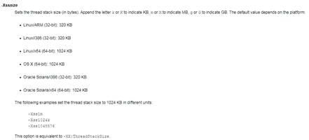
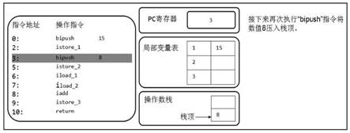
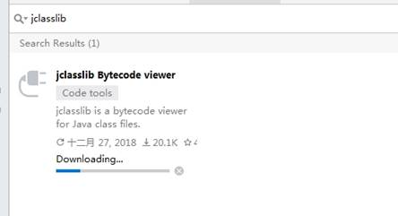

深入拆解一线大厂JVM 讲师：宋红康

\1.   概述........................................................................................................................................................................ 7

1.1.    作为Java工程师的你，曾被JVM伤害过吗？....................................................................... 7

1.2.    开发人员如何看待上层框架？........................................................................................................ 7

1.3.    架构师每天都在思考什么？............................................................................................................. 9

1.3.1.    应该如何让我的系统更快？.................................................................................................... 9

1.3.2.    如何避免系统出现瓶颈？......................................................................................................... 9

1.4.    如何看待招聘信息，直通年薪50万？....................................................................................... 9

1.5.    Java语言及Java生态圈..................................................................................................................... 9

1.5.1.    语言排行榜...................................................................................................................................... 9

1.5.2.    Java：跨平台的语言................................................................................................................... 9

1.5.3.    JVM：跨语言的平台................................................................................................................ 10

1.6.    Java发展的重大事件......................................................................................................................... 11

1.6.1.    Oracle JDK vs Open JDK........................................................................................................ 12

1.6.2.    JDK与JVM的关系................................................................................................................... 13

1.6.3.    Java vs C++.......................................................................................................................... 13

1.7.    JVM的整体结构.................................................................................................................................. 14

1.7.1.    简图.................................................................................................................................................. 14

1.7.2.    详细图............................................................................................................................................. 15

1.8.    各种JVM................................................................................................................................................. 16

1.9.    大厂面试题............................................................................................................................................. 17

\2.    类的加载篇...................................................................................................................................................... 18

2.1.    大厂面试题............................................................................................................................................. 18

2.2.    类加载子系统作用.............................................................................................................................. 19

2.3.    类的加载过程........................................................................................................................................ 20

2.3.1.    图示.................................................................................................................................................. 20

2.3.2.    细节.................................................................................................................................................. 21

2.3.3.    举例.................................................................................................................................................. 23

·   code-1................................................................................................................................................. 23

·   code-2................................................................................................................................................. 23

2.4.    类的加载器............................................................................................................................................. 24

2.4.1.    加载器的分类.............................................................................................................................. 24

2.4.2.    为什么需要用户自定义类加载器？.................................................................................. 25

2.5.    双亲委派机制........................................................................................................................................ 25

2.5.1.    举例.................................................................................................................................................. 26

2.5.2.    优势.................................................................................................................................................. 26

2.6.    破坏双亲委派机制.............................................................................................................................. 26

2.6.1.    第1次............................................................................................................................................. 27

2.6.2.    第2次............................................................................................................................................. 27

2.6.3.    第3次............................................................................................................................................. 28

2.7.    沙箱安全机制........................................................................................................................................ 29

\3.    内存结构篇...................................................................................................................................................... 31

3.1.    大厂面试题............................................................................................................................................. 33

3.2.    程序计数器............................................................................................................................................. 35

3.3.    虚拟机栈.................................................................................................................................................. 37

3.3.1.    栈的特点........................................................................................................................................ 37

3.3.2.    栈桢（Stack Frame）.............................................................................................................. 38

·   局部变量表........................................................................................................................................ 39

·   操作数栈............................................................................................................................................. 41

·   动态链接............................................................................................................................................. 43

·   方法返回地址................................................................................................................................... 44

·   一些附加信息................................................................................................................................... 44

3.4.    本地方法栈............................................................................................................................................. 44

3.5.    堆................................................................................................................................................................ 44

3.5.1.    堆的内存结构.............................................................................................................................. 45

3.5.2.    对象分配过程.............................................................................................................................. 46

3.5.3.    内存分配策略.............................................................................................................................. 47

3.5.4.    jVisualVM的使用...................................................................................................................... 48

3.5.5.    堆的各种参数.............................................................................................................................. 49

·   -Xms -Xmx......................................................................................................................................... 49

·   -Xmn..................................................................................................................................................... 50

·   -XX:NewRatio................................................................................................................................... 50

·   -XX:SurvivorRatio........................................................................................................................... 50

·   -XX:MaxTenuringThreshold...................................................................................................... 51

·   -XX:+PrintGCDetails...................................................................................................................... 51

·   -XX:HandlePromotionFailure................................................................................................... 51

3.5.6.    堆，是分配对象的唯一选择吗............................................................................................ 52

·   逃逸分析............................................................................................................................................. 53

·   栈上分配............................................................................................................................................. 53

·   同步省略............................................................................................................................................. 53

·   标量替换............................................................................................................................................. 53

3.6.    方法区....................................................................................................................................................... 53

3.6.1.    方法区在哪里？......................................................................................................................... 53

3.6.2.    栈、堆、方法区的关系........................................................................................................... 54

3.6.3.    方法区都存什么？..................................................................................................................... 54

·   运行时常量池................................................................................................................................... 55

3.6.4.    永久代与元空间......................................................................................................................... 57

3.6.5.    内存结构小结.............................................................................................................................. 58

3.6.6.    VM参数小结............................................................................................................................... 58

3.7.    直接内存.................................................................................................................................................. 58

3.8.    StringTable............................................................................................................................................. 59

3.8.1.    String的不可变性..................................................................................................................... 59

3.8.2.    String的内存分配..................................................................................................................... 60

3.8.3.    String的基本操作..................................................................................................................... 61

3.8.4.    字符串拼接操作......................................................................................................................... 63

3.8.5.    new String()问题........................................................................................................................ 64

3.8.6.    intern()方法.................................................................................................................................. 64

3.8.7.    G1的String去重操作............................................................................................................. 66

\4.    执行引擎篇...................................................................................................................................................... 66

4.1.    执行引擎工作过程.............................................................................................................................. 67

4.2.    为什么说Java是半编译半解释型语言？................................................................................ 68

4.3.    解释器....................................................................................................................................................... 68

4.4.    编译器....................................................................................................................................................... 70

4.5.    指令............................................................................................................................................................ 73

4.5.1.    java -version................................................................................................................................ 73

4.5.2.    java -Xint -version..................................................................................................................... 73

4.5.3.    java -Xcomp -version.............................................................................................................. 73

\5.    垃圾回收篇...................................................................................................................................................... 73

5.1.    大厂面试题............................................................................................................................................. 76

5.2.    垃圾回收算法........................................................................................................................................ 80

5.2.1.    垃圾标记阶段算法..................................................................................................................... 80

·   引用计数算法................................................................................................................................... 80

·   如果就想用此算法，怎么解决循环引用......................................................................... 82

·   可达性分析算法.............................................................................................................................. 82

·   GC Roots........................................................................................................................................ 83

5.2.2.    垃圾清除阶段算法..................................................................................................................... 83

·   标记-清除算法................................................................................................................................. 84

·   复制算法............................................................................................................................................. 85

·   标记-压缩算法................................................................................................................................. 86

·   分代收集算法................................................................................................................................... 87

·   分区算法............................................................................................................................................. 88

5.3.     相关概念................................................................................................................................................ 90

5.3.1.    System.gc()................................................................................................................................... 90

5.3.2.    内存泄漏与内存溢出................................................................................................................ 90

5.3.3.    STW.................................................................................................................................................. 91

5.3.4.    4种引用......................................................................................................................................... 91

·   强引用：不回收.............................................................................................................................. 91

·   软引用：内存不足即回收........................................................................................................... 91

·   弱引用：发现即回收..................................................................................................................... 92

·   虚引用：对象回收跟踪................................................................................................................ 92

5.3.5.    垃圾回收的并行与并发........................................................................................................... 92

5.3.6.    安全点与安全区域..................................................................................................................... 93

5.3.7.    内存快照分析工具..................................................................................................................... 93

5.4.     垃圾回收器........................................................................................................................................... 93

5.4.1.    GC分类.......................................................................................................................................... 93

5.4.2.    GC评估指标................................................................................................................................ 94

5.4.3.    Serial GC：串行回收................................................................................................................ 95

5.4.4.    ParNew GC：并行回收........................................................................................................... 95

5.4.5.    Parallel GC：吞吐量优先....................................................................................................... 96

5.4.6.    CMS：低延迟.............................................................................................................................. 97

5.4.7.    G1 GC：区域化分代式............................................................................................................ 97

5.4.8.    各GC使用场景.......................................................................................................................... 98

5.4.9.    GC的组合..................................................................................................................................... 99

5.4.10.   Epsilon GC.................................................................................................................................. 100

5.4.11.   Shenandoah GC...................................................................................................................... 101

5.4.12.   ZGC................................................................................................................................................ 103

5.5.     相关VM参数................................................................................................................................... 104

5.5.1.    -XX:PrintGCDetails................................................................................................................. 104

5.5.2.    -verbose:gc................................................................................................................................ 104

\6.    字节码指令篇.............................................................................................................................................. 104

6.1.     大厂面试题......................................................................................................................................... 104

6.2.     Class文件结构................................................................................................................................. 104

6.2.1.    概述............................................................................................................................................... 104

6.2.2.    解析方式..................................................................................................................................... 105

·   1-一个个字节分析：NotePad++或Binary Viewer..................................................... 105

·   2-javap指令................................................................................................................................... 105

·   3-IDEA插件：jclasslib或客户端.......................................................................................... 106

6.2.3.    文件结构..................................................................................................................................... 107

·   魔数.................................................................................................................................................... 108

·   class文件版本............................................................................................................................... 108

·   常量池............................................................................................................................................... 108

·   访问标志.......................................................................................................................................... 109

·   类索引、父类索引、接口索引集合..................................................................................... 109

·   字段表集合...................................................................................................................................... 110

·   方法表集合...................................................................................................................................... 111

·   属性表集合...................................................................................................................................... 112

6.3.     字节码指令集.................................................................................................................................... 113

\7.    JVM监控及诊断工具篇.......................................................................................................................... 113

7.1.     大厂面试题......................................................................................................................................... 113

7.2.     命令行篇............................................................................................................................................. 114

7.2.1.    概述............................................................................................................................................... 114

7.2.2.    jps................................................................................................................................................... 114

7.2.3.    jstat................................................................................................................................................ 114

7.2.4.    jinfo............................................................................................................................................... 114

7.2.5.    jmap.............................................................................................................................................. 114

7.2.6.    jhat................................................................................................................................................. 114

7.2.7.    jstack............................................................................................................................................. 114

7.2.8.    jutil................................................................................................................................................. 114

7.2.9.    jcmd.............................................................................................................................................. 114

7.3.     GUI篇................................................................................................................................................... 114

7.3.1.    jconsole....................................................................................................................................... 114

7.3.2.    VisualVM..................................................................................................................................... 115

7.3.3.    JProfiler........................................................................................................................................ 115

7.3.4.    Eclipse MAT............................................................................................................................... 115

7.3.5.    JMC................................................................................................................................................ 115

\8.    性能调优篇................................................................................................................................................... 115

8.1.     GC调优................................................................................................................................................ 115

8.2.     代码层调优......................................................................................................................................... 115

 

\1.    概述

| 单图标 |  CustomIcon--601256336; ["", "cI4p3AAAAAAAAAAAAAAAAA=="] |
| ------ | ------------------------------------------------------------ |
|        |                                                              |

1.1.     作为Java工程师的你，曾被JVM伤害过吗？

你是否也遇到过这些问题？

 

·     运行着的线上系统突然卡死，系统无法访问，甚至直接OOM！

·     想解决线上JVM GC问题，但却无从下手。

·     新项目上线，对各种JVM参数设置一脸茫然，直接默认吧，然后就JJ了

·     每次面试之前都要重新背一遍JVM的一些原理概念性的东西，然而面试官却经常问你在实际项目中如何调优JVM参数，如何解决GC、OOM等问题，一脸懵逼。

 

1.2.     开发人员如何看待上层框架？

 

大部分Java开发人员，除会在项目中使用到与Java平台相关的各种高精尖技术，对于Java技术的核心Java虚拟机了解甚少。

·     一些有一定工作经验的开发人员，打心眼儿里觉得SSM、微服务等上层技术才是重点，基础技术并不重要，这其实是一种本末倒置的“病态”。

 

·     如果我们把核心类库的 API 比做数学公式的话，那么 Java 虚拟机的知识就好比公式的推导过程。

 

 

计算机系统体系对我们来说越来越远，在不了解底层实现方式的前提下，通过高级语言很容易编写程序代码。但事实上计算机并不认识高级语言。

 

 

 

 

 

1.3.     架构师每天都在思考什么？

1.3.1.     应该如何让我的系统更快？

1.3.2.     如何避免系统出现瓶颈？

1.4.     如何看待招聘信息，直通年薪50万？

·     参与现有系统的性能优化，重构，保证平台性能和稳定性

·     根据业务场景和需求，决定技术方向，做技术选型

·     能够独立架构和设计海量数据下高并发分布式解决方案，满足功能和非功能需求

·     解决各类潜在系统风险，核心功能的架构与代码编写

·     分析系统瓶颈，解决各种疑难杂症，性能调优等

 

1.5.     Java语言及Java生态圈

1.5.1.     语言排行榜

\1.  有很多同学，问我如何选择编程语言？

 

\2.  **世界上没有最好的编程语言，只有最适用于具体应用场景的编程语言。**

 

 

 

1.5.2.     Java：跨平台的语言

 

**“write once, run anywhere.”**

 

1.5.3.     JVM：跨语言的平台

 

Java虚拟机根本不关心运行在其内部的程序到底是使用何种编程语言编写的，它只关心“字节码”文件。

 

**Java不是最强大的语言，但是JVM是最强大的虚拟机。**

 

 

 

1.6.     Java发展的重大事件

·     1990年，在 Sun 计算机公司中，由 Patrick Naughton、MikeSheridan 及 James Gosling 领导的小组Green Team，开发出的新的程序语言，命名为Oak，后期命名为Java

·     1995年，Sun正式发布Java和HotJava产品，Java首次公开亮相。

·     1996年1月23日Sun Microsystems发布了JDK 1.0。

·     1998年，JDK 1.2版本发布。同时，Sun发布了 JSP/Servlet、EJB规范，以及将Java分成了 J2EE、J2SE和J2ME。 这表明了 Java开始向企业、桌面应用和移动设备应用3大领域挺进。

·     2000年，JDK 1.3发布，Java HotSpot Virtual Machine正式发布，成为Java的默认虚拟机。

·     2002年，JDK 1.4发布，古老的Classic虚拟机退出历史舞台。

·     2003年年底，Java平台的Scala正式发布，同年Groovy也加入了 Java阵营。

·     2004年，JDK 1.5发布。同时JDK 1.5改名为JavaSE 5.0。

·     2006年，JDK 6发布。同年，Java开源并建立了 OpenJDK。顺理成章，Hotspot虚拟机也成为了 OpenJDK中的默认虚拟机。

·     2007年，Java平台迎来了新伙伴Clojure。

·     2008 年，Oracle 收购了 BEA,得到了 JRockit 虚拟机。

·     2009年，Twitter宣布把后台大部分程序从Ruby迁移到Scala，这是Java平台的又一次大规模应用。

·     2010年，Oracle收购了Sun，获得Java商标和最具价值的HotSpot虚拟机。此时，Oracle拥有市场占用率最高的两款虚拟机HotSpot和JRockit，并计划在未来对它们进行整合：HotRockit. JCP组织管理：Java语言

·     2011年，JDK7发布。在JDK 1.7u4中，正式启用了新的垃圾回收器G1。

·     2017年，JDK9发布。将G1设置为默认GC，替代CMS

·     同年，IBM的J9开源，形成了现在的Open J9社区

·     2018年，Android的Java侵权案判决，Google赔偿Oracle计88亿美元

·     同年，Oracle宣告JavaEE成为历史名词，JDBC、JMS、Servlet赠予Eclipse基金会

·     同年，JDK11发布，LTS版本的JDK,发布革命性的ZGC,调整JDK授权许可

·     2019年，JDK12发布，加入RedHat领导开发的Shenandoah GC

 

1.6.1.     Oracle JDK vs Open JDK

1.6.2.     JDK与JVM的关系

 

1.6.3.     Java vs C++

 java = (c++)--;

 

垃圾收集机制为我们打理了很多繁琐的工作，大大提高了开发的效率，但是，垃圾收集也不是万能的，懂得JVM内部的内存结构、工作机制，是设计高扩展性应用和诊断运行时问题的基础，也是Java工程师进阶的必备能力。

 

1.7.     JVM的整体结构

1.7.1.     简图

 

 

这个架构可以分成三层看：

·     最上层：javac编译器将编译好的字节码class文件，通过java 类装载器执行机制，把对象或class文件存放在 jvm划分内存区域。

·     中间层：称为Runtime Data Area，主要是在Java代码运行时用于存放数据的，从左至右为方法区(永久代、元数据区)、堆(共享,GC回收对象区域)、栈、程序计数器、寄存器、本地方法栈(私有)。

·     最下层：解释器、JIT(just in time)编译器和 GC（Garbage Collection，垃圾回收器）

 

1.7.2.     详细图

1.8.     各种JVM

·     Sun Classic VM -->解释型

·     Exact VM  --> Solaris

·     **SUN****公司的** **HotSpot VM**

·     **BEA** **的** **JRockit -->** **不包含解释器，服务器端，****JMC**

·     **IBM** **的** **J9**

·     KVM和CDC/CLDC Hotspot

·     Azul VM

·     Liquid VM

·     Apache Harmony

·     Microsoft JVM

·     TaobaoJVM

·     **Graal VM --> 2018****年****,“Run Programs Faster Anywhere”**

 

·     Dalvik VM

 

·     其他JVM：

 Java Card VM、Squawk VM、JavaInJava、Maxine VM、Jikes RVM、IKVM.NET、Jam VM、   Cacao VM、Sable VM、Kaffe、Jelatine JVM、Nano VM、MRP、Moxie JVM

 

1.9.     大厂面试题

阿里：

什么是Java虚拟机(JVM)，为什么要使用？（JVM = Japanese Vedio's Man ）

\> 虚拟机：指以软件的方式模拟具有完整硬件系统功能、运行在一个完全隔离环境中的完整计算机系统 ，是物理机的软件实现。常用的虚拟机有VMWare，Visual Box，Java Virtual Machine（Java虚拟机，简称JVM）

 

说说Java虚拟机的生命周期及体系结构。

  虚拟机的启动  Java虚拟机的启动是通过引导类加载器(bootstrap class loader)创建一个初始类(initial class)来完成的，这个类是由虚拟机的具体实现指定的。     **虚拟机的退出**  有如下的几种情况：  ·      某线程调用Runtime类或System类的exit方法，或 Runtime类的halt方法，并且Java安全管理器也允许这次exit或halt操作。  ·      程序正常执行结束  ·      程序在执行过程中遇到了异常或错误而异常终止  ·      由于操作系统出现错误而导致Java虚拟机进程终止  

 

字节跳动：

一面：JVM的组成

 

\2.    类的加载篇

| 单图标 |  CustomIcon--33569288; ["", "+MX//QAAAAAAAAAAAAAAAA=="] |
| ------ | ------------------------------------------------------------ |
|        |                                                              |

2.1.     大厂面试题

蚂蚁金服：

深入分析ClassLoader，双亲委派机制

描述一下 JVM 加载 Class 文件的原理机制?

类加载器的双亲委派模型是什么？

一面：类加载过程

一面：双亲委派机制及使用原因

 

百度：

类加载的时机

java 类加载过程?

类加载器都有哪些？

简述 java 类加载机制?

 

腾讯：

JVM中类加载机制，类加载过程，什么是双亲委派模型？

类加载器有哪些

 

小米：

双亲委派模型介绍一下

 

滴滴：

JVM类加载机制

一面：讲一下双亲委派模型，以及其优点

 

字节跳动：

什么是类加载器，类加载器有哪些？

 

美团：

Java类加载过程

描述一下jvm加载class文件的原理机制

 

京东：

什么是类的加载？

哪些情况会触发类的加载？

讲一下JVM加载一个类的过程

JVM的类加载机制是什么？

类加载器的双亲委派模型是什么？

双亲委派机制可以打破吗？为什么

 

此外：

简单说说你了解的类加载器

 

2.2.     类加载子系统作用

 ClassLoader只负责class文件的加载，至于它是否可以运行，则由Execution Engine决定。

 

 

2.3.     类的加载过程

2.3.1.     图示

 

 

2.3.2.     细节

**一、加载：**

·     通过一个类的全限定名获取定义此类的二进制字节流

·     将这个字节流所代表的静态存储结构转化为方法区的运行时数据结构

·     在内存中生成一个代表这个类的java.lang.Class对象，作为方法区这个类的各种数据的访问入口

 注意：数组类是如何创建加载的呢？

 

**二、链接：**

**验证****(Verify)****：**

·     目的在于确保Class文件的字节流中包含信息符合当前虚拟机要求，保证被加载类的正确性，不会危害虚拟机自身安全。

·     主要包括四种验证，文件格式验证，元数据验证，字节码验证，符号引用验证。

**准备****(Prepare)****：**

·     为类变量分配内存并且设置该类变量的默认初始值，即零值。

·     这里不包含用final修饰的static，因为final在编译的时候就会分配了，准备阶段会显式初始化；

·     这里不会为实例变量分配初始化，类变量会分配在方法区中，而实例变量是会随着对象一起分配到Java堆中。

·     见LoadClass.java

**解析****(Resolve)****：**

·     将常量池内的符号引用转换为直接引用的过程。

·     事实上，解析操作往往会伴随着JVM在执行完初始化之后再执行。

符号引用就是一组符号来描述所引用的目标。符号引用的字面量形式明确定义在《java虚拟机规范》的Class文件格式中。

在解析阶段，jvm根据字符串的内容找到内存区域中相应的地址，然后把符号引用替换成直接指向目标的指针、句柄、偏移量等，这些直接指向目标的指针、句柄、偏移量就被成为**直接引用**。

·     解析动作主要针对类或接口、字段、类方法、接口方法、方法类型等。对应常量池中的CONSTANT_Class_info、CONSTANT_Fieldref_info、CONSTANT_Methodref_info等。

·     见Demo.java

**三、初始化：**

·     初始化阶段就是执行类构造器方法<clinit>()的过程。

·     此方法不需定义，是javac编译器自动收集类中的所有类变量的赋值动作和静态代码块中的语句合并而来。

·     构造器方法中指令按语句在源文件中出现的顺序执行。

·     <clinit>()不同于类的构造器。(关联：构造器是虚拟机视角下的<init>())

·     若该类具有父类，JVM会保证子类的<clinit>()执行前，父类的<clinit>()已经执行完毕。

·     虚拟机必须保证一个类的<clinit>()方法在多线程下被同步加锁。

·     见Clinit.java

 

 

2.3.3.     举例

·     code-1

**public class** HelloApp {
   **static**{
     *num* = 10;*//**变量赋值可以正常编译通过**
\*     *//System.out.println(num);//**编译器提示**“**非法前向引用**"
\*   }
   **static int** *num* = 1;
 
   **public static void** main(String[] args) {
     System.***out\***.println(HelloApp.*num*);
   }
 
 }
 

 

 

·     code-2

**public class** ClinitTest {
 
   **static class** Father{
     **public static int** *A* = 1;
     **static**{
       *A* = 2;
     }
   }
 
   **static class** Son **extends** Father{
     **public static int** *B* = *A*;
   }
 
   **public static void** main(String[] args) {
     System.***out\***.println(Son.*B*);
   }
 
 }

 

2.4.     类的加载器

2.4.1.     加载器的分类

·     JVM支持两种类型的类加载器，分别为引导类加载器（Bootstrap ClassLoader）和自定义类加载器（User-Defined ClassLoader）

·     怎么算自定义呢？

·     这里的四者之间的关系是包含关系。不是上层下层，也不是子父类的继承关系。

 

2.4.2.     为什么需要用户自定义类加载器？

·     在Java的日常应用程序开发中，类的加载几乎是由上述3种类加载器相互配合执行的，在必要时，我们还可以自定义类加载器，来定制类的加载方式。

·     **为什么要自定义类加载器？**

·     隔离加载类,避免类冲突

·     修改类加载的方式，根据实际情况在某个时间点按需动态加载

·     扩展加载源：网络、数据库、机顶盒

·     防止源码泄漏

 

2.5.     双亲委派机制

 

·     **工作原理**

1)如果一个类加载器收到了类加载请求，它并不会自己先去加载，而是把这个请求委托给父类的加载器去执行;

2)如果父类加载器还存在其父类加载器，则进一步向上委托，依次递归，请求最终将到达顶层的启动类加载器;

3)如果父类加载器可以完成类加载任务，就成功返回，倘若父类加载器无法完成此加载任务，子加载器才会尝试自己去加载，这就是双亲委派模式。

 

 

2.5.1.     举例

**package** java.lang;
 
 */**
 \* **@author** shkstart
 \* **@create** 2020* *下午* *9:24
 \*/
\* **public class** String {
   **public static void** main(String[] args) {
     System.***out\***.println(**"hello!"**);
   }
 }

 

运行：

2.5.2.     优势

·     避免类的重复加载

·     保护程序安全，防止核心API被随意篡改

·     自定义类：java.lang.String

·     自定义类：java.lang.ShkStart

2.6.     破坏双亲委派机制

Java开发者建议开发者们遵循此类加载器的实现方式。同时，Java世界中的大部分类也遵循这个模型。

 

例外情况：Java模块化出现。出现了3次较大规模的“被破坏”情况

 

 

 

2.6.1.     第1次

发生在双亲委派模型出现之前——即JDK 1.2面世以前的“远古”时代。

类加载器的概念和抽象类java.lang.ClassLoader则在Java的第一个版本中就已经存在，面对已经存在的用户自定义类加载器的代码，Java设计者们引入双亲委派模型时不得不做出一些妥协，为了兼容这些已有代码，**无法再以技术手段避免****loadClass()****被子类覆盖的可能性，只能在****JDK 1.2****之后的****java.lang.ClassLoader****中添加一个新的****protected****方法****findClass()****，并引导用户编写的类加载逻辑时尽可能去重写这个方法，而不是在****loadClass()****中编写代码。**

2.6.2.     第2次

双亲委派模型的第二次“被破坏”是由这个模型自身的缺陷导致的，双亲委派很好地解决了各个类加载器协作时基础类型的一致性问题（**越基础的类由越上层的加载器进行加载**），基础类型之所以被称为“基础”，是因为它们总是作为被用户代码继承、调用的API存在，但**如果有基础类型又要调用回用户的代码，那该怎么办呢？**

 

一个典型的例子便是JNDI服务，JNDI现在已经是Java的标准服务，在JDK 1.3时加入到rt.jar。JNDI存在的目的就是对资源进行查找和集中管理，它需要调用由其他厂商实现并部署在应用程序的ClassPath下的JNDI服务提供者接口（Service Provider Interface，SPI）的代码。

**这是一种父类加载器去请求子类加载器完成类加载的行为，这种行为实际上是打通了双亲委派**

**模型的层次结构来逆向使用类加载器，已经违背了双亲委派模型的一般性原则。**

 

Java中涉及SPI的加载基本上都采用这种方式来完成，例如JNDI、JDBC、JCE、JAXB和JBI等

2.6.3.     第3次

双亲委派模型的第三次“被破坏”是由于用户对程序动态性的追求而导致的。如：**代码热替换（****Hot Swap****）、模块热部署（****Hot Deployment****）**等

 

IBM公司主导的JSR-291（即OSGi R4.2）实现模块化热部署的关键是它自定义的类加载器机制的实现，每一个程序模块（OSGi中称为Bundle）都有一个自己的类加载器，当需要更换一个Bundle时，就把Bundle连同类加载器一起换掉以实现代码的热替换。在OSGi环境下，类加载器不再双亲委派模型推荐的树状结构，而是进一步发展为更加复杂的网状结构。

 

当收到类加载请求时，OSGi将按照下面的顺序进行类搜索：

1）将以java.*开头的类，委派给父类加载器加载。

2）否则，将委派列表名单内的类，委派给父类加载器加载。

3）否则，将Import列表中的类，委派给Export这个类的Bundle的类加载器加载。

4）否则，查找当前Bundle的ClassPath，使用自己的类加载器加载。

5）否则，查找类是否在自己的Fragment Bundle中，如果在，则委派给Fragment Bundle的类加载器加载。

6）否则，查找Dynamic Import列表的Bundle，委派给对应Bundle的类加载器加载。

7）否则，类查找失败。

 

说明：只有开头两点仍然符合双亲委派模型的原则，其余的类查找都是在平级的类加载器中进行的

2.7.     沙箱安全机制

Java安全模型的核心就是Java沙箱（sandbox），什么是沙箱？沙箱是一个限制程序运行的环境。沙箱机制就是将Java代码限定在虚拟机（JVM）特定的运行范围中，并且严格限制代码对本地系统资源访问，通过这样的措施来保证对代码的有限隔离，防止对本地系统造成破坏。**沙箱主要限制系统资源访问**，那系统资源包括什么？CPU、内存、文件系统、网络。不同级别的沙箱对这些资源访问的限制也可以不一样。

 所有的Java程序运行都可以指定沙箱

增加了安全策略：

增加了代码签名：

引入域：系统域和应用域

 

 

 

 

\3.    内存结构篇

| 单图标 |  CustomIcon-1192109814; ["", "9iYORwAAAAAAAAAAAAAAAA=="] |
| ------ | ------------------------------------------------------------ |
|        |                                                              |

 

 

 

 

 

3.1.     大厂面试题

百度：

百度一面：JVM的参数，你知道的说一下

百度三面：说一下JVM内存模型吧，有哪些区？分别干什么的？

 

支付宝：

支付宝一面：JVM的内存划分，垃圾回收机制等

JVM的内存结构是什么样子的？

 

蚂蚁金服：

Java8的内存分代改进

JVM 内存分哪几个区，每个区的作用是什么?

Java虚拟机内存模型能说说吗？

一面：对象在堆内存创建的生命周期

一面：JVM内存分布/内存结构？栈和堆的区别？堆的结构？为什么两个survivor区？

二面：java对象头里有什么

Eden和Survior的比例分配

 

小米：

jvm内存分区，为什么要有新生代和老年代

 

滴滴：

一面：讲一下JVM内存布局

 

 

携程：

讲讲jvm分区

 

字节跳动：

二面：Java的内存分区

二面：讲讲jvm运行时数据库区

什么时候对象会进入老年代？

 

京东：

JVM的内存结构，Eden和Survivor比例。

JVM内存为什么要分成新生代，老年代，持久代。新生代中为什么要分为Eden和Survivor。

 

天猫：

一面：Jvm内存模型以及分区，需要详细到每个区放什么。

一面：JVM的内存模型，Java8做了什么修改

 

拼多多：

JVM 内存分哪几个区，每个区的作用是什么?

 

 

美团：

java内存分配

jvm的永久代中会发生垃圾回收吗？

一面：jvm内存分区，为什么要有新生代和老年代？

 

阿里：

说一说Java内存区域。

Java虚拟机中，数据类型可以分为哪几类？

怎么理解栈、堆？堆中存什么？栈中存什么？

为什么要把堆和栈区分出来呢？栈中不是也可以存储数据吗？

在Java中，什么是栈的起始点，同是也是程序的起始点？

为什么不把基本类型放堆中呢？

Java中的参数传递时传值呢？还是传引用？

Java中有没有指针的概念？

Java中，栈的大小通过什么参数来设置？

堆大小通过什么参数设置？

 

此外：

什么情况下会发生栈内存溢出。

JVM的内存结构，Eden和Survivor比例。

JVM内存为什么要分成新生代，老年代，持久代。新生代中为什么要分为Eden和Survivor。

 

3.2.     程序计数器

·     JVM中的程序计数寄存器（Program Counter Register）中， Register 的命名源于CPU 的寄存器，寄存器存储指令相关的现场信息。 CPU 只有把数据装载到寄存器才能够运行。

·     举例：

  public int test() {      int x = 0;      int y = 1;      return x + y;  }     

 对应的字节码：

  public int test();      descriptor: ()I          flags: ACC_PUBLIC          Code:       stack=2, locals=3, args_size=1        0: iconst_0        1: istore_1        2: iconst_1        3: istore_2        4: iload_1        5: iload_2        6: iadd        7: ireturn           LineNumberTable:        line 7: 0        line 8: 2        line 9: 4       LocalVariableTable:        Start Length Slot Name  Signature              0    8   0 this    Lcom/alibaba/uc/TestClass;          2    6   1   x   I          4    4   2   y   I     

 

·     为什么需要记录当前线程的执行地址？

·     为什么PC寄存器是线程私有的？

3.3.     虚拟机栈

·     有不少Java开发人员一提到Java内存结构，就会非常粗粒度地将JVM中的内存区理解为仅有Java堆(heap)和Java栈(stack)？

·     如何理解栈管运行，堆管存储？

 

 

3.3.1.     栈的特点

\1. 基本操作

\2. 栈中存在垃圾回收吗？

\3. 栈中可能抛出的异常是什么？StackOverflowError？OutOfMemoryError？

\4. 如何设置栈内存的大小？ -Xss size (即：-XX:ThreadStackSize)

  一般默认为512k-1024k，取决于操作系统。

 

3.3.2.     栈桢（Stack Frame）

\1. 方法和栈桢之间存在怎样的关系？

  \> 栈帧是一个内存区块，是一个数据集，维系着方法执行过程中的各种数据信息。

 

\2. 栈桢的内部结构

 

·     局部变量表

\1. 定义为一个数字数组，主要用于存储方法参数和定义在方法体内的局部变量

 

\2. 这些数据类型包括各类基本数据类型、对象引用（reference），以及returnAddress类型

\3. 存在线程安全问题吗？

\4. 举例

  **public  class** SlotTest {     **public void** localVarl()  {       **int** a = 0;       System.***out\***.println(a);       **int** b = 0;     }        **public void** localVar2()  {       {         **int** a = 0;         System.***out\***.println(a);       }       *//**此时的**b**就会复用**a**的槽位** *      **int** b = 0;     }   }  

 

\5. 局部变量表中的变量也是重要的垃圾回收根节点，只要被局部变量表中直接或间接引用的对象都不会被回收。

 

 

·     操作数栈

\1. 操作数栈，也称为表达式栈，后进先出。

\2. 在方法执行过程中，根据字节码指令，往栈中写入数据或提取数据，即入栈(push)/出栈(pop)。并非采用索引访问。

\3. 举例：

**public void** testAddOperation(){
   **byte** i = 15;
   **int** j = 8;
   **int** k = i + j;
 }

\4. 字节码分析：

 

 

 

 

 

·     动态链接

**动态链接（或指向运行时常量池的方法引用）**

\1. 每一个栈帧内部包含一个指向运行时常量池中该栈帧所属方法的引用，包含这个引用的目的就是为了支持当前方法的代码能够实现动态链接

\2. 在java源文件被编译到字节码文件中时，所有的变量和方法引用都作为符号引用（Symbolic Reference）保存在class文件的常量池里。比如：描述一个方法调用了另外的其他方法时，就是通过常量池中指向方法的符号引用来表示的，那么动态链接的作用就是为了将这些符号引用转换为调用方法的直接引用。

\3. **为什么需要常量池？**

**public class** SimpleClass {
   **public void** sayHello() {
     System.***out\***.println(**"hello"**);
   }
 }

 

·     方法返回地址

·     一些附加信息

3.4.     本地方法栈

·     Java 虚拟机栈用于管理Java 方法的调用，而本地方法栈用于管理本地方法的调用。

·     本地方法是使用C语言实现的。

·     它的具体做法是Native Method Stack中登记native方法，在Execution Engine 执行时加载本地方法库。

3.5.     堆

·     一个JVM实例只存在一个堆内存，堆也是Java内存管理的核心区域，也是GC的重点区域。

·     《Java虚拟机规范》规定，堆可以处于物理上不连续的内存空间中，但在逻辑上它应该被视为连续的。

·     举例：

  **public  class** SimpleHeap {     **private int** **id**;        **public** SimpleHeap(**int** id) {       **this**.**id** = id;     }        **public void** show()  {       System.***out\***.println(**"My ID is "** + **id**);     }        **public static void** main(String[] args) {       SimpleHeap sl = **new** SimpleHeap(1);       SimpleHeap s2 = **new** SimpleHeap(2);     }   }  

 

 

3.5.1.     堆的内存结构

·     堆空间的细分结构：

 

·     默认情况下：新生代、老年代的比例如何？ 1:2

   新生代的Eden、S0、S1的比例如何？8:1:1

·     所有的线程共享Java堆，在这里还可以划分线程私有的缓冲区（Thread Local Allocation Buffer, TLAB)。

·     在程序中，开发人员可以通过选项“-XX:UseTLAB”设置是否开启TLAB空间。

·     默认情况下，TLAB空间的内存非常小，仅占有整个Eden空间的1%，当然我们可以通过选项“-XX:TLABWasteTargetPercent”设置TLAB空间所占用Eden空间的百分比大小。

 

 

3.5.2.     对象分配过程

 

 

3.5.3.     内存分配策略

针对不同年龄段的对象分配原则如下所示：

 

·     优先分配到Eden

·     大对象直接分配到老年代 

·     长期存活的对象分配到老年代

·     空间分配担保

·     动态对象年龄判断

 

**堆空间分代思想**

为什么需要把Java 堆分代？不分代就不能正常工作了吗？

 

 

answer:分代的唯一理由就是优化GC 性能。

3.5.4.     jVisualVM的使用

*/**
 \* -Xms600m -Xmx600m -XX:SurvivorRatio=8
 \* **@author** shkstart
 \* **@create** 2020* *下午* *5:45
 \*/
\* **public class** HeapInstanceTest {
   **byte**[] **buffer** = **new byte**[1024 * 100];*//100KB
 
\*   **public static void** main(String[] args) {
     ArrayList<HeapInstanceTest> list = **new** ArrayList<>();
     **while**(**true**){
       list.add(**new** HeapInstanceTest());
       **try** {
         Thread.*sleep*(20);
       } **catch** (InterruptedException e) {
         e.printStackTrace();
       }
     }
   }
 }

 

 

 

3.5.5.     堆的各种参数

·     -Xms -Xmx

·     堆空间大小的设置： -Xms:初始内存 （默认为物理内存的1/64）；

​                -Xmx:最大内存（默认为物理内存的1/4）；

 

  */**    \* -Xms10m -Xmx10m    \*    \* **@author** shkstart    \* **@create** 2020* *上午* *10:48    \*/ *  **public class** HeapSpaceTest {     **public static void** main(String[] args) {       String str = **"atguigu"**;       List<String> list = **new** ArrayList<>();       **try** {         **while**(**true**){                str += UUID.*randomUUID*().toString();             list.add(str);         }       } **catch** (Throwable e) {           e.printStackTrace();         System.***out\***.println(list.size());       }     }   }     

 

 

·     -Xmn

设置新生代的大小。(初始值及最大值)

通常默认即可。

·     -XX:NewRatio

配置新生代与老年代在堆结构的占比。赋的值即为老年代的占比，剩下的1给新生代

默认-XX:NewRatio=2，表示新生代占1，老年代占2，新生代占整个堆的1/3

-XX:NewRatio=4，表示新生代占1，老年代占4，新生代占整个堆的1/5

·     -XX:SurvivorRatio

·     在HotSpot中，Eden空间和另外两个Survivor空间缺省所占的比例是8：1

·     开发人员可以通过选项“-XX:SurvivorRatio”调整这个空间比例。比如-XX:SurvivorRatio=8

 

·     -XX:MaxTenuringThreshold

·     设置新生代垃圾的最大年龄。超过此值，仍未被回收的话，则进入老年代。

·     默认值为15

·     -XX:MaxTenuringThreshold=0：表示年轻代对象不经过Survivor区，直接进入老年代。对于老年代比较多的应用，可以提高效率。

·     如果将此值设置为一个较大值，则年轻代对象会在Survivor区进行多次复制，这样可以增加对象在年轻代的存活时间，增加在年轻代即被回收的概率。

·     -XX:+PrintGCDetails

输出详细的GC处理日志

显示如下：

Heap

 PSYoungGen   total 9728K, used 2497K [0x00000000fd580000, 0x00000000fe000000, 0x0000000100000000)

 eden space 8704K, 28% used [0x00000000fd580000,0x00000000fd7f06e8,0x00000000fde00000)

 from space 1024K, 0% used [0x00000000fdf00000,0x00000000fdf00000,0x00000000fe000000)

 to  space 1024K, 0% used [0x00000000fde00000,0x00000000fde00000,0x00000000fdf00000)

 ParOldGen    total 22016K, used 0K [0x00000000f8000000, 0x00000000f9580000, 0x00000000fd580000)

 object space 22016K, 0% used [0x00000000f8000000,0x00000000f8000000,0x00000000f9580000)

 Metaspace    used 3511K, capacity 4498K, committed 4864K, reserved 1056768K

 class space   used 388K, capacity 390K, committed 512K, reserved 1048576K

 

·     -XX:HandlePromotionFailure

在发生Minor GC之前，虚拟机会检查老年代最大可用的连续空间是否大于新生代所有对象的总空间，

·     如果大于，则此次Minor GC是安全的

·     如果小于，则虚拟机会查看-XX:HandlePromotionFailure设置值是否允许担保失败。

·     如果HandlePromotionFailure=true，那么会继续检查老年代最大可用连续空间是否大于历次晋升到老年代的对象的平均大小，如果大于，则尝试进行一次Minor GC，但这次Minor GC依然是有风险的；如果小于或者HandlePromotionFailure=false，则改为进行一次Full GC。

\----------------------------

在JDK 6 Update 24之后，HandlePromotionFailure参数不会再影响到虚拟机的空间分配担保策略，观察OpenJDK中的源码变化，虽然源码中还定义了HandlePromotionFailure参数，但是在代码中已经不会再使用它。JDK 6 Update 24之后的规则变为只要老年代的连续空间大于新生代对象总大小或者历次晋升的平均大小就会进行Minor GC，否则将进行Full GC。

 

3.5.6.     堆，是分配对象的唯一选择吗

在《深入理解Java虚拟机中》关于Java堆内存有这样一段描述：

随着JIT编译期的发展与逃逸分析技术逐渐成熟，栈上分配、标量替换优化技术将会导致一些微妙的变化，所有的对象都分配到堆上也渐渐变得不那么“绝对”了。

 

在Java虚拟机中，对象是在Java堆中分配内存的，这是一个普遍的常识。但是，有一种特殊情况，那就是如果经过逃逸分析(Escape Analysis)后发现，一个对象并没有逃逸出方法的话，那么就可能被优化成栈上分配。这样就无需在堆上分配内存，也无须进行垃圾回收了。这也是最常见的堆外存储技术。

 

·     逃逸分析

·     栈上分配

·     同步省略

·     标量替换

3.6.     方法区

3.6.1.     方法区在哪里？

《Java虚拟机规范》中明确说明: “尽管所有的方法区在逻辑上是属于堆的一部分，但一些简单的实现可能不会选择去进行垃圾收集或者进行压缩。” 但对于HotSpotJVM而言，方法区还有一个别名叫做Non-Heap(非堆)，目的就是要和堆分开。所以，方法区看作是一块独立于Java 堆的内存空间。

 

 

 

 

 

3.6.2.     栈、堆、方法区的关系

 

 

 

3.6.3.     方法区都存什么？

 

方法区都存什么？

 

 

·     运行时常量池

要弄清楚方法区的运行时常量池，需要理解清楚ClassFile中的常量池。

 

举例：

  public class SimpleClass {     public  void sayHello() {         System.out.println("hello");     }  }  

这个已生成的类文件中的常量池像如下这样：

  Constant pool:  #1 = Methodref       #6.#17      // java/lang/Object.”<init>”:()V  #2 = Fieldref       #18.#19      //   java/lang/System.out:Ljava/io/PrintStream;  #3 = String        #20        // “Hello”  #4 = Methodref       #21.#22      //   java/io/PrintStream.println:(Ljava/lang/String;)V  #5 = Class         #23        //   org/jvminternals/SimpleClass  #6 = Class         #24        //   java/lang/Object  #7 = Utf8           <init>  #8 = Utf8           ()V  #9 = Utf8           Code  #10 = Utf8           LineNumberTable  #11 = Utf8           LocalVariableTable  #12 = Utf8           this  #13 = Utf8           Lorg/jvminternals/SimpleClass;  #14 = Utf8           sayHello  #15 = Utf8           SourceFile  #16 = Utf8           SimpleClass.java  #17 = NameAndType      #7:#8       // “<init>”:()V  #18 = Class         #25        //   java/lang/System  #19 = NameAndType      #26:#27      // out:Ljava/io/PrintStream;  #20 = Utf8           Hello  #21 = Class         #28        // java/io/PrintStream  #22 = NameAndType      #29:#30      // println:(Ljava/lang/String;)V  #23 = Utf8           org/jvminternals/SimpleClass  #24 = Utf8           java/lang/Object  #25 = Utf8           java/lang/System  #26 = Utf8           out  #27 = Utf8           Ljava/io/PrintStream;  #28 = Utf8           java/io/PrintStream  #29 = Utf8           println  #30 = Utf8           (Ljava/lang/String;)V  

小结：

常量池，可以看做是一张表，虚拟机指令根据这张常量表找到要执行的类名、方法名、参数类型、字面量等类型。

 

 

 

3.6.4.     永久代与元空间

\1. BEA JRockit、IBM J9等来说，是不存在永久代的概念的。原则上如何实现方法区属于虚拟机实现细节，不受《Java虚拟机规范》管束，并不要求统一。

 

\2. HotSpot中永久代的变化

jdk1.6及之前：有永久代(permanent generation)

jdk1.7：有永久代，但已经逐步“去永久代”，字符串常量池、静态变量移除，保存在堆中

jdk1.8及之后： 无永久代，类型信息、字段、方法、常量保存在本地内存的元空间，但字符串常量池仍在堆

 

\3. 永久代为什么要被元空间替换？ （元空间，使用本地内存）

 http://openjdk.java.net/jeps/122

① 为永久代设置空间大小是很难确定的

② 对永久代进行调优是困难的

 

3.6.5.     内存结构小结

 

 

 

3.6.6.     VM参数小结

 

JDK8中：

-XX:MetaspaceSize

-XX:MaxMetaspaceSize：默认值是-1，即不限制

 

3.7.     直接内存

·     直接内存是在Java堆外的、直接向系统申请的内存区间。

·     通常，访问直接内存的速度会优于Java堆。即读写性能高。

·     缺点

·     分配回收成本较高

·     不受JVM内存回收管理

 

3.8.     StringTable

3.8.1.     String的不可变性

 1.通过字面量的方式（区别于new）给一个字符串赋值，此时的字符串值声明在字符串常量池中。
 2.字符串常量池中是不会存储相同内容的字符串的。

@Test
 **public void** test1() {
   String s1 = **"abc"**;*//**字面量的定义方式**
\*    String s2 = **"abc"**;
   s1 = **"hello"**;
 
   System.***out\***.println(s1 == s2);*//**比较**s1**和**s2**的地址值**
 
\*   System.***out\***.println(s1);*//hello
\*   System.***out\***.println(s2);*//abc
 
\*   System.***out\***.println(**"\**\**\**\**\**\**\**\**\*"**);
 
   String s3 = **"abc"**;
   s3 += **"def"**;
   System.***out\***.println(s3);*//abcdef
\*   System.***out\***.println(s2);
 
   System.***out\***.println(**"\**\**\**\**\**\**\**\**\*"**);
 
   String s4 = **"abc"**;
   String s5 = s4.replace(**'a'**, **'m'**);
   System.***out\***.println(s4);*//abc
\*   System.***out\***.println(s5);*//mbc
 
\* }
 
 
 @Test
 **public void** test2(){
   StringTest1 ex = **new** StringTest1();
   ex.change(ex.**str**, ex.**ch**);
   System.***out\***.print(ex.**str** + **" and "**);*//
\*   System.***out\***.println(ex.**ch**);
 }
 String **str** = **new** String(**"good"**);
 **char**[] **ch** = { **'t'**, **'e'**, **'s'**, **'t'** };
 
 **public void** change(String str, **char** ch[]) {
   str = **"test ok"**;
   ch[0] = **'b'**;
 }

 

3.8.2.     String的内存分配

整体来说：

·     Java 6及以前，字符串常量池存放在永久代。

·     Java 7 中 Oracle 的工程师对字符串池的逻辑做了很大的改变，即将字符串常量池的位置调整到Java堆内。

·     Java 8 中，字符串常量仍然在堆。

 

**StringTable****为什么要调整？**

 

 官网：

https://www.oracle.com/technetwork/java/javase/jdk7-relnotes-418459.html#jdk7changes

 

举例：

jdk6:

jdk8:

具体细节：数组+链表

String的String Pool是一个固定大小的Hashtable，默认值大小长度是1009，如果放进String Pool的String非常多，就会造成Hash冲突严重，从而导致链表会很长，而链表长了后直接会造成的影响就是当调用String.intern时性能会大幅下降（因为要一个一个找）。

在 jdk6中StringTable是固定的，就是1009的长度，所以如果常量池中的字符串过多就会导致效率下降很快。在jdk7中，StringTable的长度可以通过一个参数指定：

·     -XX:StringTableSize=99991

 

 

3.8.3.     String的基本操作

**public class** StringTest3 {
   @Test
   **public void** test1(){
     System.***out\***.println();*//2320
\*     System.***out\***.println();*//2321
\*     System.***out\***.println();*//2321
\*     System.***out\***.println(**"1"**);*//2321
\*     System.***out\***.println(**"2"**);
     System.***out\***.println(**"3"**);
     System.***out\***.println(**"4"**);
     System.***out\***.println(**"5"**);
     System.***out\***.println(**"6"**);
     System.***out\***.println(**"7"**);
     System.***out\***.println(**"8"**);
     System.***out\***.println(**"9"**);
     System.***out\***.println(**"10"**);*//2330
 
\*     System.***out\***.println(**"1"**);*//2331
\*     System.***out\***.println(**"2"**);*//2331
\*     System.***out\***.println(**"3"**);
     System.***out\***.println(**"4"**);
     System.***out\***.println(**"5"**);
     System.***out\***.println(**"6"**);
     System.***out\***.println(**"7"**);
     System.***out\***.println(**"8"**);
     System.***out\***.println(**"9"**);
     System.***out\***.println(**"10"**);*//2331
\*   }
   @Test
   **public void** test2(){
     String s1 = **"a"** + **"b"** + **"c"**;*//**常量优化机制**,**编译的时候就已经是**abc
\*     String s2 = **"abc"**;
     */\*
     ** *最终**.java**编译成**.class,**再执行**.class
     \* String s1 = "abc";
     \* String s2 = "abc"
     \*/
\*     System.***out\***.println(s1 == s2); *//true
\*     System.***out\***.println(s1.equals(s2)); *//true
\*   }
 

}

3.8.4.     字符串拼接操作

@Test
 **public void** test3(){
   String s1 = **"a"**;
   String s2 = **"b"**;
   String s3 = **"ab"**;
   String s4 = s1 + s2;*//new StringBuilder().append("a").append("b").toString() --> new String("ab")
\*   System.***out\***.println(s3 == s4);
 }

 

@Test
 **public void** test4(){
   **final** String s1 = **"a"**;
   **final** String s2 = **"b"**;
   String s3 = **"ab"**;
   String s4 = s1 + s2;
   System.***out\***.println(s3 == s4);
 }

 

*//**体会执行效率：**
\* **public void** method1(){
   String src = **""**;
   **for**(**int** i = 0;i < 10;i++){
     src = src + **"a"**;*//**每次循环都会创建一个**StringBuilder
\*   }
   System.***out\***.println(src);
   
 }
 
 **public void** method2(){
   StringBuilder src = **new** StringBuilder();
   **for** (**int** i = 0; i < 10; i++) {
     src.append(**"a"**);
     
   }
   System.***out\***.println(src);
 }

 

 

3.8.5.     new String()问题

String的实例化方式： 

·     方式一：通过字面量定义的方式

·     方式二：通过new + 构造器的方式

·     面试题：String s = new String("abc");方式创建对象，在内存中创建了几个对象？
     两个:一个是堆空间中new结构，另一个是char[]对应的常量池中的数据："abc"

3.8.6.     intern()方法

**public class** StringTest4 {
   **public static void** main(String[] args) {
     String s = **new** String(**"1"**);
     s.intern();
     String s2 = **"1"**;
     System.***out\***.println(s == s2);*//
 
\*     String s3 = **new** String(**"1"**) + **new** String(**"1"**);
     s3.intern();
     String s4 = **"11"**;
     System.***out\***.println(s3 == s4);*//
\*   }
 }

jdk6中的解释：

 

jdk7中的解释：

 

题目变形：

 @Test
 **public void** test1(){
   String s = **new** String(**"1"**);
   String s2 = **"1"**;
   s.intern();
   System.***out\***.println(s == s2);*//
 
\*   String s3 = **new** String(**"1"**) + **new** String(**"1"**);
   String s4 = **"11"**;
   s3.intern();
   System.***out\***.println(s3 == s4);*//
   
\* }

 

3.8.7.     G1的String去重操作

问题：String底层是什么结构？

 

新的需求：

许多大规模的java应用的瓶颈在于内存，测试表明，在这些类型的应用里面，java堆中存活的数据集合差不多25%是String对象。更进一步，这里面差不多一半String对象是重复的，重复的意思是说：string1.equals(string2)=true。堆上存在重复的String对象必然是一种内存的浪费。这个项目将在G1垃圾收集器中实现自动持续对重复的String对象进行去重，这样就能避免浪费内存。

说明：

String去重不需要对jdk的类库和已经存在的java代码做任何的改动。

 

\4.    执行引擎篇

| 单图标 |  CustomIcon--167171855; ["", "8SgJ9gAAAAAAAAAAAAAAAA=="] |
| ------ | ------------------------------------------------------------ |
|        |                                                              |

4.1.     执行引擎工作过程

 

\1) 执行引擎在执行的过程中究竟需要执行什么样的字节码指令完全依赖于PC寄存器。

\2) 每当执行完一项指令操作后，PC寄存器就会更新下一条需要被执行的指令地址。

\3) 当然方法在执行的过程中，执行引擎有可能会通过存储在局部变量表中的对象引用准确定位到存储在Java堆区中的对象实例信息，以及通过对象头中的元数据指针定位到目标对象的类型信息。

 

 

4.2.     为什么说Java是半编译半解释型语言？

 

 

 

 

4.3.     解释器

事实上，计算机并不认识高级语言，在执行过程中我们会把高级语言转换成计算机所能理解的一种中间格式（如汇编语言），然后才能理解计算机如何解释和执行这些中间的程序，以及系统的哪一部分影响程序的执行效率。

 

 

 

现状：

由于解释器在设计和实现上非常简单，因此除了Java语言之外，还有许多高级语言同样也是基于解释器执行的，比如Python、Perl、Ruby等。但是在今天，基于解释器执行已经沦落为低效的代名词，并且时常被一些C/C++程序员所调侃。

 

 

4.4.     编译器

概念解释：

Java 语言的 “编译期” 其实是一段 “不确定” 的操作过程。

1）因为它可能是指一个**前端编译器**（其实叫 “编译器的前端” 更准确一些）把 .java文件转变成 .class文件的过程；

2）也可能是指虚拟机的**后端运行期编译器**（**JIT** **编译器**，Just In Time Compiler）把字节码转变成机器码的过程。

3）还可能是指使用**静态提前编译器**（AOT 编译器，Ahead Of Time Compiler）直接把.java文件编译成本地机器代码的过程。

 

·     HotSpot VM是目前市面上高性能虚拟机的代表作之一。它采用解释器与即时编译器并存的架构。

·     曾经你对我爱答不理，今天我让你高攀不起。

 

**如何选择？**

当然是否需要启动JIT编译器将字节码直接编译为对应平台的本地机器指令，则需要根据代码被调用执行的频率而定。关于那些需要被编译为本地代码的字节码，也被称之为“热点代码”，JIT编译器在运行时会针对那些频繁被调用的“热点代码”做出深度优化，将其直接编译为对应平台的本地机器指令，以此提升Java程序的执行性能。

 

·     方法调用计数器

·     回边计数器

 

问题来了！

有些开发人员会感觉到诧异，**既然****HotSpot VM****中已经内置****JIT****编译器了，那么为什么还需要再使用解释器来****“****拖累****”****程序的执行性能呢？**

 

4.5.     指令

4.5.1.     java -version

4.5.2.     java -Xint -version

4.5.3.     java -Xcomp -version

\5.    垃圾回收篇

| 单图标 |  CustomIcon-448216691; ["", "cz63GgAAAAAAAAAAAAAAAA=="] |
| ------ | ------------------------------------------------------------ |
|        |                                                              |

 

 

 

问一下：硬盘存满了数据，会变重吗？

 

Java中垃圾回收的重点区域是？

·     从次数上讲：

·     频繁收集Young区

·     较少收集Old区

·     基本不动方法区

 

 

 

 

 

5.1.     大厂面试题

百度：

说一下GC算法，分代回收说下

垃圾收集策略和算法

三面：说一下gc算法，分代回收说下

简述 java 内存分配与回收策率以及 Minor GC 和Major GC

三面：说一下gc算法，分代回收说下

 

蚂蚁金服：

JVM垃圾回收机制，何时触发Minor GC等操作

OOM的错误，StackOverFlow错误，permgen space的错误

JVM的一次完整的GC流程（从ygc到fgc)是怎样的，重点讲讲对象如何晋升到老年代，几种主要的jvm参数

垃圾回收的优点和原理。

你知道哪几种垃圾回收器，各自的优缺点，重点讲一下cms和g1

一面：JVM GC算法有哪些，目前的JDK版本采用什么回收算法

新生代和老年代的内存回收策略

一面：G1回收器讲下回收过程

GC是什么？为什么要有GC？

如何判断一个对象是否存活？

什么时候对象可以被收回？

一面：JVM有哪些回收算法，对应的收集器有哪些？

一面：GC 的两种判定方法 ？CMS 收集器与 G1 收集器的特点。

一面：GC 的两种判定方法 ？CMS 收集器与 G1 收集器的特点。

 

携程：

讲讲jvm的gc

 

天猫：

一面：jvm GC原理，JVM怎么回收内存

一面：CMS特点，垃圾回收算法有哪些？各自的优缺点，他们共同的缺点是什么？

 

京东：

JVM中一次完整的GC流程是怎样的，对象如何晋升到老年代，说说你知道的几种主要的JVM参数。

你知道哪几种垃圾收集器，各自的优缺点，重点讲下cms和G1，包括原理，流程，优缺点。

垃圾回收算法的实现原理。

当出现了内存溢出，你怎么排错。

 

滴滴：

一面：说一下什么情况发生栈溢出

一面：java的垃圾回收器都有哪些，说下g1的应用场景，平时你是如何搭配使用垃圾回收器的

二面；有实际的JVM性能调优案例吗？重点需要关注哪些核心参数？

 

小米：

说几个垃圾回收器，cms回收器有哪几个过程，停顿几次，会不会产生内存碎片。老年代产生内存碎片会有什么问题。

jvm场景问题， 标记清除多次后老年代产生内存碎片，引起full gc，接下来可能发生什么问题。

 

阿里：

讲一讲垃圾回收算法。

如何解决内存碎片的问题？

什么情况下触发垃圾回收？

如何选择合适的垃圾收集算法？

JVM有哪三种垃圾回收器？

JVM中最大堆大小有没有限制？

吞吐量优先选择什么垃圾回收器？响应时间优先呢？

 

拼多多：

JVM有哪些回收算法，对应的收集器有哪些？

GC 的两种判定方法 ？CMS 收集器与 G1 收集器的特点。

Java GC机制？GC Roots有哪些？

 

腾讯：

jvm怎样 判断一个对象是否可回收，怎样的对象才能作为GC root

OOM说一下？怎么排查？哪些会导致OOM? OOM出现在什么时候

什么是Full GC？GC? major GC? stop the world

描述JVM中一次full gc过程

 

字节跳动：

常见的垃圾回收器算法有哪些，各有什么优劣？

syatem，gc**()**和runtime，gc**()**会做做什么事情？

一面：Java GC机制？GC Roots有哪些？

二面：Java对象的回收方式，回收算法。

CMS和G1了解么，CMS解决什么问题，说一下回收的过程。

CMS回收停顿了几次，为什么要停顿两次。

三面：Java存在内存溢出的现象吗，内存的分配方式、GC机制;

一面：讲讲你知道的垃圾回收算法

一面：内存泄漏与内存溢出的区别

GC用什么收集器，收集的过程如何？哪些部分可以作为GC Root？

 

抖音：

一面：Java GC机制？GC Roots有哪些？

二面：JVM的内存布局以及垃圾回收原理及过程讲一下，讲一下CMS垃圾收集器垃圾回收的流程，以及CMS的缺点

 

京东：

一面：Java GC机制？GC Roots有哪些？

一面：Java怎么进行垃圾回收的？什么对象会进老年代？垃圾回收算法有哪些？为什么新生代使用复制算法？

JVM垃圾收集算法与收集器有哪些？

讲一下Jvm中如何判断对象的生死？

 

美团：

GC是什么？为什么要有GC？

简述java垃圾回收机制

如何判断一个对象是否存活？（或者GC对象的判定方法）

垃圾回收的优点和原理。并考虑2种回收机制。

垃圾回收器的基本原理是什么？垃圾回收器可以马上回收内存吗？

有什么办法主动通知虚拟机进行垃圾回收？

java中会存在内存泄漏吗，请简单描述。

二面：jvm场景问题， 标记清除多次后老年代产生内存碎片，引起full gc，接下来可能发生什么问题？

GC root如何确定，哪些对象可以作为GC Root?

GC如何分代的？各代用什么算法回收？

CMS过程是怎样的？内部使用什么算法做垃圾回收？

分代垃圾回收过程？

 

此外：

JVM中一次完整的GC流程是怎样的，对象如何晋升到老年代，说说你知道的几种主要的JVM参数。

你知道哪几种垃圾收集器，各自的优缺点，重点讲下cms和G1，包括原理，流程，优缺点。

垃圾回收算法的实现原理。

当出现了内存溢出，你怎么排错。

g1和cms区别,吞吐量优先和响应优先的垃圾收集器选择

串行（serial）收集器和吞吐量（throughout）收集器的区别是什么？

在Java中，对象什么时候可以被垃圾回收？

简述Java内存分配与回收策率以及minor GC和majorGC。

Java中垃圾收集的方法有哪些？

 

5.2.     垃圾回收算法

5.2.1.     垃圾标记阶段算法

在堆里存放着几乎所有的java对象实例，在GC 执行垃圾回收之前，首先需要区分出内存中哪些是存活对象，哪些是已经死亡的对象。只有被标记为己经死亡的对象， GC 才会在执行垃圾回收时，释放掉其所占用的内存空间， 因此这个过程我们可以称为垃圾标记阶段。

 

那么在JVM中究竟是如何标记一个死亡对象呢？

简单来说，当一个对象已经不再被任何的存活对象继续引用时，就可以宣判为已经死亡。

 

·     引用计数算法

原理：

对于一个对象A，只要有任何一个对象引用了A ，则A 的引用计数器就加1，当引用失效时，引用计数器就减1。只要对象A 的引用计数器的值为0，即表示对象A不可能再被使用，可进行回收。

 

优点：**实现简单，垃圾对象便于辨识；判定效率高，回收没有延迟性。**

 

缺点：

缺点1：它需要单独的字段存储计数器，这样的做法增加了存储空间的开销。

缺点2：每次赋值都需要更新计数器，伴随着加法和减法操作，这增加了时间开销。

缺点3：引用计数器有一个严重的问题，即无法处理循环引用的情况。这是一条致命缺陷，导致在Java 的垃圾回收器中没有使用这类算法。

 

 

 

举例：

**public class** RefCountGC {
   *//**这个成员属性唯一的作用就是占用一点内存**
\*   **private byte**[] **bigSize** = **new byte**[4 * 1024 * 1024];
 
   Object **reference** = **null**;
 
   **public static void** main(String[] args) {
     RefCountGC obj1 = **new** RefCountGC();
     RefCountGC obj2 = **new** RefCountGC();
 
     obj1.**reference** = obj2;
     obj2.**reference** = obj1;
 
     obj1 = **null**;
     obj2 = **null**;
     *//**不加如下的操作，就没有垃圾回收*

​    *//这里发生GC，obj1和obj2能否被回收？
\*     System.*gc*();
   }
 }

 

 

 

·     如果就想用此算法，怎么解决循环引用

手动解除：很好理解，就是在合适的时机，解除引用关系。

使用弱引用weakref。

·     可达性分析算法

原理：

 其原理简单来说，就是将对象及其引用关系看作一个图，选定活动的对象作为 GC Roots，然后跟踪引用链条，如果一个对象和GC Roots之间不可达，也就是不存在引用链条，那么即可认为是可回收对象。

 

优点：

实现简单，执行高效 ，有效的解决循环引用的问题，防止内存泄漏。

 

 

·     GC Roots

在Java 语言中， GC Roots 包括以下几类元素：

·     虚拟机栈中引用的对象

·     比如：各个线程被调用的方法中使用到的参数、局部变量等。

·     方法区中类静态属性引用的对象

·     方法区中常量池中的引用

·     所有被同步锁synchronized持有的对象

·     Java虚拟机内部的引用。

·     基本数据类型对应的Class对象，一些常驻的异常对象（如：NullPointerException、OutOfMemoryError），系统类加载器。

·     本地方法栈内JNI(通常说的本地方法)引用的对象

·     反映java虚拟机内部情况的JMXBean、JVMTI中注册的回调、本地代码缓存等。

 

5.2.2.     垃圾清除阶段算法

当成功区分出内存中存活对象和死亡对象后， GC 接下来的任务就是执行垃圾回收，释放掉无用对象所占用的内存空间，以便有足够的可用内存空间为新对象分配内存。目前在JVM中比较常见的三种垃圾收集算法是标记－清除算法（ Mark-Sweep ）、复制算法（ Copying ）、标记 - 压缩算法（ Mark-Compact ） 。

 

 

 

·     标记-清除算法

标记：对存活的对象进行标记。

清除：清除没有标记的，也就是垃圾对象。

（很多书、视频讲错了！说是标记的垃圾对象。这里要注意了！）

 

 

缺点：

1、效率比较低：递归与全堆对象遍历两次

2、在进行GC的时候，需要停止整个应用程序，导致用户体验差

3、这种方式清理出来的空闲内存是不连续的，产生内存碎片。

 

 

 

·     复制算法

 

优点：

·     没有标记和清除过程，实现简单，运行高效

·     复制过去以后保证空间的连续性，不会出现“碎片”问题。

 

缺点：

·     此算法的缺点也是很明显的，就是需要两倍的内存空间。

·     另外，对于G1这种分拆成为大量region的GC，复制而不是移动，意味着GC需要维护region之间对象引用关系，这个开销也不小，不管是内存占用或者时间开销。 

应用场景：

在新生代，对常规应用的垃圾回收，一次通常可以回收70%-99%的内存空间。回收性价比很高。所以现在的商业虚拟机都是用这种收集算法回收新生代。

比如：IBM 公司的专门研究表明，新生代中 80% 的对象都是“朝生夕死”的。

 

·     标记-压缩算法

**背景：**

复制算法的高效性是建立在存活对象少、垃圾对象多的前提下的。这种情况在新生代经常发生，但是在老年代，更常见的情况是大部分对象都是存活对象。如果依然使用复制算法，由于存活对象较多，复制的成本也将很高。因此，基于老年代垃圾回收的特性，需要使用其他的算法。

 

标记－清除算法的确可以应用在老年代中，但是该算法不仅执行效率低下，而且在执行完内存回收后还会产生内存碎片，所以JVM 的设计者需要在此基础之上进行改进。标记 - 压缩（Mark - Compact）算法由此诞生。

 

**优点：****（**此算法消除了“标记-清除”和“复制”两个算法的弊端。）

·     消除了标记/清除算法当中，内存区域分散的缺点，我们需要给新对象分配内存时，JVM只需要持有一个内存的起始地址即可。

·     消除了复制算法当中，内存减半的高额代价。

 

**缺点：**

·     从效率上来说，标记-压缩算法要低于复制算法。

·     效率不高，不仅要标记所有存活对象，还要整理所有存活对象的引用地址。

·     对于老年代每次都有大量对象存活的区域来说，极为负重。

·     移动对象的同时，如果对象被其他对象引用，则还需要调整引用的地址。

·     移动过程中，需要全程暂停用户应用程序。即：STW

 

·     分代收集算法

 三种算法的对比：

 

效率上来说，复制算法是当之无愧的老大，但是却浪费了太多内存。而为了尽量兼顾上面提到的三个指标，标记-整理算法相对来说更平滑一些，但是效率上不尽如人意，它比复制算法多了一个标记的阶段，比标记-清除多了一个整理内存的阶段。

 

·     目前几乎所有的GC都是采用分代收集（Generational Collecting）算法执行垃圾回收的。

·     在HotSpot 中，基于分代的概念， GC 所使用的内存回收算法必须结合年轻代和老年代各自的特点。

·     年轻代(Young Gen)

​      年轻代特点是区域相对老年代较小，对象生命周期短、存活率低，回收频繁。

·     老年代(Tenured Gen)

​      老年代的特点是区域较大，对象生命周期长、存活率高，回收不及年轻代频繁。

 

 

·     分区算法

**分区算法：****---G1 GC****使用的算法**

分代算法将按照对象的生命周期长短划分成两个部分，分区算法将整个堆空间划分成连续的不同小区间。

 

每一个小区间都独立使用，独立回收。这种算法的好处是可以控制一次回收多少个小区间。

一般来说，在相同条件下，堆空间越大，一次GC时所需要的时间就越长，有关GC产生的停顿也越长。为了更好地控制GC产生的停顿时间，将一块大的内存区域分割成多个小块，根据目标的停顿时间，每次合理地回收若干个小区间，而不是整个堆空间，从而减少一次GC所产生的停顿。

 

 

 

\1.  

\2.  

\3.  

 

5.3.     相关概念

5.3.1.     System.gc()

在默认情况下， 通过System.gc()或者Runtime.getRuntime().gc()的调用，会显式触发Full GC，同时对老年代和新生代进行回收。会有一些效果，但是系统是否进行垃圾回收依然不确定。

 

而一般情况下，垃圾回收应该是自动进行的，无须手动触发， 否则就太过于麻烦了。

 

5.3.2.     内存泄漏与内存溢出

javadoc中对OutOfMemoryError的解释是，没有空闲内存，并且垃圾收集器也无法提供更多内存。

·     首先说没有空闲内存的情况：说明Java虚拟机的堆内存不够。原因有二：

**（****1****）****Java****虚拟机的堆内存设置不够。**

**（****2****）代码中创建了大量大对象，并且长时间不能被垃圾收集器收集（存在被引用）**

 

内存泄漏（Memory Leak）

也称作“存储渗漏”，用动态存储分配函数动态开辟的空间，在使用完毕后未被释放，结果导致一直占据该内存单元，一直持续到程序结束，即所谓内存泄漏。

 

举例：

1、单例模式

单例的生命周期和应用程序是一样长的，所以单例程序中，如果持有对外部对象的引用的话，那么这个外部对象是不能被回收的，则会导致内存泄漏的产生。

2、一些提供close的资源未关闭导致内存泄漏

数据库连接（dataSourse.getConnection()），网络连接(socket)和io连接必须手动close，否则是不能被回收的。

 

5.3.3.     STW

·     Stop-the-World ，简称STW ，指的是GC 事件发生过程中，会产生应用程序的停顿。停顿产生时整个应用程序线程都会被暂停，没有任何响应，有点像卡死的感觉，这个停顿称为STW 。

·     STW 事件和采用哪款GC 无关， 所有的GC 都有这个事件。

·     哪怕是G1 也不能完全避免Stop-the-world 情况发生，只能说垃圾回收器越来越优秀，回收效率越来越高， 尽可能地缩短了暂停时间。

·     被STW 中断的应用程序线程会在完成GC 之后恢复， 频繁中断会让用户感觉像是网速不快造成电影卡带一样，所以我们需要减少STW 的发生。

·     开发中不要用System.gc();会stop the world的错误。

 

5.3.4.     4种引用

·     强引用：不回收

·     软引用：内存不足即回收

·     弱引用：发现即回收

·     虚引用：对象回收跟踪

5.3.5.     垃圾回收的并行与并发

并发和并行，在谈论垃圾收集器的上下文语境中，它们可以解释如下： 

 

·     并行（Parallel）：指多条垃圾收集线程并行工作，但此时用户线程仍处于等待状态。

如ParNew、Parallel Scavenge、Parallel Old；

·     串行（Serial）

·     相较于并行的概念，单线程执行。

·     如果内存不够，则程序暂停，启动jvm垃圾回收器进行垃圾回收。回收完，再启动程序的线程。

 

·     并发（Concurrent）：指用户线程与垃圾收集线程同时执行（但不一定是并行的，可能会交替执行），垃圾回收线程在执行时不会停顿用户程序的运行。

·     用户程序在继续运行，而垃圾收集程序线程运行于另一个CPU上； 

·     如：CMS、G1

 

 

 

5.3.6.     安全点与安全区域

5.3.7.     内存快照分析工具

5.4.     垃圾回收器

5.4.1.     GC分类

·     **按线程数分，可以分为串行垃圾回收器和并行垃圾回收器。**

 

·     **按照工作模式分，可以分为并发式垃圾回收器和独占式垃圾回收器。**

·     **并发式垃圾回收器与应用程序线程交替工作，以尽可能减少应用程序的停顿时间。**

·     **独占式垃圾回收器（** **Stop the world)****一旦运行，就停止应用程序中的其他所有线程，直到垃圾回收过程完全结束。**

 

·     **按碎片处理方式可分为压缩式垃圾回收器和非压缩式垃圾回收器。**

·     **压缩式垃圾回收器会在回收完成后，对存活对象进行压缩整理，消除回收后的碎片。**

·     **非压缩式的垃圾回收器不进行这步操作。**

 

·     **按工作的内存区间，又可分为年轻代垃圾回收器和老年代垃圾回收器。**

 

5.4.2.     GC评估指标

·     吞吐量：程序的运行时间（程序的运行时间＋内存回收的时间）。

 

·     垃圾收集开销：吞吐量的补数，垃圾收集器所占时间与总时间的比例。

·     暂停时间：执行垃圾收集时，程序的工作线程被暂停的时间。

·     收集频率：相对于应用程序的执行，收集操作发生的频率。

·     内存占用： Java 堆区所占的内存大小。

·     快速： 一个对象从诞生到被回收所经历的时间。

 

吞吐量优先：单位时间内，STW的时间最短：0.2 + 0.2 = 0.4

响应时间优先：尽可能让单次STW的时间最短：0.1 + 0.1 + 0.1 + 0.1 + 0.1 = 0.5

 

红色的三项共同构成一个“不可能三角”。三者总体的表现会随着技术进步而越来越好。一款优秀的收集器通常最多同时满足其中的两项。

这三项里，低延迟的重要性日益凸显。

5.4.3.     Serial GC：串行回收

 

·     Serial 收集器采用复制算法、串行回收和“ Stop-the-World ”机制的方式执行内存回收。

 

 

·     优势：简单而高效（与其他收集器的单线程比），对于限定单个 CPU 的环境来说，Serial收集器由于没有线程交互的开销，专心做垃圾收集自然可以获得最高的单线程收集效率。

 

·     在HotSpot 虚拟机中，使用 -XX: +UseSerialGC 参数可以指定使用年轻代串行收集器和老年代串行收集器。

·     等价于 新生代用Serial GC，且老年代用Serial Old GC

 

5.4.4.     ParNew GC：并行回收

·     如果说Serial GC是年轻代中的单线程垃圾收集器，那么ParNew 收集器则是Serial 收集器的多线程版本。

·     Par是Parallel的缩写，New：只能处理的是新生代

 

·     ParNew 收集器除了采用并行回收的方式执行内存回收外，两款垃圾收集器之间几乎没有任何区别，因为ParNew 收集器在年轻代中同样也是采用复制算法、“ Stop-the-World"机制。

 

 

·     在程序中，开发人员可以通过选项“ -XX:+UseParNewGC ”手动指定使用ParNew 收集器执行内存回收任务。它表示年轻代使用并行收集器。

 

5.4.5.     Parallel GC：吞吐量优先

·     HotSpot 的年轻代中除了拥有ParNew 收集器是基于并行回收的以外， Parallel收集器同样也采用了复制算法、并行回收和“ Stop the World ”机制。

 

·     那么Parallel收集器的出现是否多此一举？和ParNew 收集器不同，Parallel Scavenge 收集器的目标则是达到一个**可控制的吞吐量**（Throughput），它也被称为吞吐量优先的垃圾收集器。

 

 

·     “ -XX:+UseParallelGC ”手动指定年轻代使用Parallel 并行收集器执行内存回收任务。

·     “ -XX:+UseParallelOldGC” 手动指定年轻代和老年代都是使用并行回收收集器。

5.4.6.     CMS：低延迟

在 JDK 1.5 时期，HotSpot 推出了一款在强交互应用中**几乎可认为有划时代意义的垃圾收集器**——CMS (Concurrent-Mark-Sweep)收集器，这款收集器是 HotSpot 虚拟机中**第一款真正意义上的并发收集器**，它第一次实现了让垃圾收集线程与用户线程同时工作。

 

在G1出现之前，CMS使用还是非常广泛的。

 

·     -XX :+UseConcMarkSweepGC：手动指定使用CMS 收集器执行内存回收任务

 

 

5.4.7.     G1 GC：区域化分代式

**既然我们已经有了前面几个强大的****GC****，为什么还要发布****Garbage First****（****G1****）****GC****？**

原因就在于应用程序所应对的业务越来越庞大、复杂，用户越来越多，没有GC就不能保证应用程序正常进行，而经常造成STW的GC又跟不上实际的需求，所以才会不断地尝试对GC进行优化。G1（Garbage-First）收集器是当今收集器技术发展的最前沿成果之一。

 

·     G1（Garbage-First）是一款面向服务端应用的垃圾收集器，兼顾吞吐量和停顿时间的GC实现。

·     在JDK1.7版本正式启用，是JDK 9以后的默认GC选项，取代了CMS 回收器。

 

 

5.4.8.     各GC使用场景

·     Serial收集器：串行运行；作用于新生代；复制算法；响应速度优先；适用于单CPU环境下的client模式。 

·     ParNew收集器：并行运行；作用于新生代；复制算法；响应速度优先；多CPU环境Server模式下与CMS配合使用。 

·     Parallel Scavenge收集器：并行运行；作用于新生代；复制算法；吞吐量优先；适用于后台运算而不需要太多交互的场景。 

·     Serial Old收集器：串行运行；作用于老年代；标记-整理算法；响应速度优先；单CPU环境下的Client模式。 

·     Parallel Old收集器：并行运行；作用于老年代；标记-整理算法；吞吐量优先；适用于后台运算而不需要太多交互的场景。 

·     CMS收集器：并发运行；作用于老年代；标记-清除算法；响应速度优先；适用于互联网或B/S业务。

·     G1收集器：并发运行；可作用于新生代或老年代；标记-整理算法+复制算法；响应速度优先；面向服务端应用。

 

5.4.9.     GC的组合

 

·     由于维护和兼容性测试的成本，在JDK 8时将Serial+CMS、ParNew+Serial Old这两个组合声明为废弃（JEP 173），并在JDK 9中完全取消了这些组合的支持（JEP214）

·     JDK14新特性：ParallelScavenge + SerialOld GC的GC组合要被标记为Deprecate了。

 

5.4.10.    Epsilon GC

 

Epsilon GC （http://openjdk.java.net/jeps/318），只做内存分配，不做垃圾回收的GC，对于运行完就退出的程序非常适合。称为无操作的垃圾收集器。

 

 

5.4.11.    Shenandoah GC

 

Shenandoah，无疑是众多GC中最孤独的一个。是第一款不由Oracle公司团队领导开发的HotSpot垃圾收集器。不可避免的收到官方的排挤。比如号称OpenJDK和OracleJDK没有区别的Oracle公司仍拒绝在OracleJDK12中支持Shenandoah。

 

Red Hat 研发 Shenandoah 团队对外宣称，Shenandoah 垃圾回收器的暂停时间与堆大小无关，这意味着无论将堆设置为 200 MB 还是 200 GB， 99.9%的目标都可以把垃圾收集的停顿时间限制在十毫秒以内。

 

 

5.4.12.    ZGC

令人震惊、革命性的ZGC

·     ZGC与Shenandoah目标高度相似，在尽可能对吞吐量影响不大的前提下，实现在任意堆内存大小下都可以把垃圾收集的停顿时间限制在十毫秒以内的低延迟。

 

·     《深入理解Java虚拟机》一书中这样定义ZGC：ZGC收集器是一款基于Region内存布局的，（暂时）不设分代的，使用了读屏障、染色指针和内存多重映射等技术来实现可并发的标记-压缩算法的，以低延迟为首要目标的一款垃圾收集器。

 

5.5.     相关VM参数

5.5.1.     -XX:PrintGCDetails

打印垃圾回收的详细信息

5.5.2.     -verbose:gc

打印垃圾回收的日志信息

\6.    字节码指令篇

| 单图标 |  CustomIcon--1181528067; ["",  "/U+TuQAAAAAAAAAAAAAAAA=="] |
| ------ | ------------------------------------------------------------ |
|        |                                                              |

6.1.     大厂面试题

百度：

类文件结构

知道字节码吗？字节码都有哪些？Integer x = 5，int y = 5，比较x = y 都经过哪些步骤？

 

 

6.2.     Class文件结构

6.2.1.     概述

 

 

 

 

 

 

6.2.2.     解析方式

·     1-一个个字节分析：NotePad++或Binary Viewer

 

·     2-javap指令

 

·     3-IDEA插件：jclasslib或客户端

 

6.2.3.     文件结构

即：

ClassFile {

 u4   magic；

 u2   minor_version；

 u2   major_version；

 u2   constant_pool_count ；

 cp_info  constant_pool[constant_pool_count-1]；

 u2   access_flags；

 u2   this_class；

 u2   super_class；

 u2   interfaces_count；

 u2   interfaces[interfaces_count]；

 u2   fields_count；

 field_info    fields[fields_count]；

 u2   methods_count；

 method_info    methods[methods_count]；

 u2   attributes_count；

 attribute_info attributes[attributes_count]；

} 

 

·     魔数

**Magic** **（魔数）**

·     每个 Class 文件的头 4 个字节称为“魔数（Magic Number）”

·     它的唯一作用是确定这个文件是否为一个能被虚拟机所接受的有效、合法的class文件。

·     class文件的魔数值固定为OxCAFEBABE，不会改变。

 

·     class文件版本

**版本号**

·     排列在magic后的第5个和第6个字节所代表的含义就是编译的副版本号minor_version，而第7个和第8个字节就是编译的主版本号major_version。

·     验证字节码文件的主版本号和次版本号同样也是格式验证的任务之一，因为如果是高版本的JDK编译的字节码文件，自然不能在低版本的JVM中运行，否则JVM会抛出java.lang.UnsupportedClassVersionError异常。

 

 

·     常量池

常量池（constant_pool）

 

和符号表类似，详情请看下面的“运行时常量池”

 

**1. constant_pool_count** **（常量池计数器）**

constant_pool_count的值等于常量池表中的成员数加1。常量池表的索引值只有在大于0且小于constant_pool_count时才会认为是有效的，对于long和 double类型有例外情况。

**2. constant_pool []****（常量池）**

constant_pool是一种表结构，以 1 ~ constant_pool_count - 1为索引。

 

它包含class文件结构及其子结构中引用的所有字符串常量、类或接口名、字段名和其他常量。常量池中的每一项都具备相同的特征——第1个字节作为类型标记，用于确定该项的格式，这个字节称为tag byte （标记字节、标签字节）。

 

·     访问标志

**访问标志**

常量池后面就是访问标志，用两个字节来表示，其标识了类或者接口的访问信息，比如：该Class文件是类还是接口，是否被定义成public，是否是abstract，如果是类，是否被声明成final等等。各种访问标志如下所示：

 

·     类索引、父类索引、接口索引集合

**类索引、父类索引、接口索引**

访问标志后的两个字节就是类索引;

类索引后的两个字节就是父类索引；

父类索引后的两个字节则是接口索引计数器。

通过这三项，就可以确定了这个类的继承关系了。

 

·     字段表集合

 

字段表用来描述类或者接口中声明的变量。这里的字段包含了类级别变量以及实例变量，但是不包括方法内部声明的局部变量。

 

fields：指向常量池索引集合，它完整描述了每个字段。

·     fields_count （字段计数器）

fields_count的值表示当前class文件fields表的成员个数。fields表中每个成员都是一个field_info结构，用于表示该类或接口所声明的类字段或者实例字段。

 

·     fields []（字段表）

fields表中的每个成员都必须是一个fields_info结构的数据项，用 于表示当前类或接口中某个字段的完整描述。fields表描述当前类或接口声明的所有字段，但不包括从父类或父接口继承的那些字段。

 

字段表访问标志：

 

·     方法表集合

methods：指向常量池索引集合，它完整描述了每个方法的签名，如果这个方法不是抽象的或者不是native的，那么字节码中会体现出来。

 

·     methods_count （方法计数器）

methods_count的值表示当前class文件methods表的成员个数。methods 表中每个成员都是一个method_info结构。

 

·     methods []（方法表）

methods表中的每个成员都必须是一个method_info结构，用于表示当前类或接口中某个方法的完整描述。如果某个method_info结构的access_ flags项既没有设置 ACC_NATIVE 标志也没有设置ACC_ABSTRACT标志，那么该 结构中也应包含实现这个方法所用的Java虚拟机指令。

method_info 结构可以表示类和接口中定义的所有方法，包括实例方法、类方法、 实例初始化方法和类或接口初始化方法。methods表只描述当前类或接口中声明的方法，不包括从父类或父接口继承的方法。

方法表访问标志：

方法表结构：

 

 

 

·     属性表集合

前面说到了属性表，现在来重点看下。属性表不仅在方法表有用到，字段表和Class文件中也会用得到。本篇文章中用到的例子在字段表中的属性个数为0，所以也没涉及到；在方法表中用到了2次，都是Code属性；至于Class文件，在末尾时会讲到，这里就先不说了。

 

 

attributes：不同值的集合，它提供了额外的关于这个类的信息，包括任何带有RetentionPolicy.CLASS 或者RetentionPolicy.RUNTIME的注解。

·     attributes_count （属性计数器）

attributes_count的值表示当前class文件属性表的成员个数。属性表中每一项都是一个attribute_info结构。

 

·     attributes []（属性表）

属性表的每个项的值必须是attribute_info结构。

 

 

6.3.     字节码指令集

见《JVM指令手册》

\7.    JVM监控及诊断工具篇

| 单图标 |  CustomIcon-1010503750; ["", "RhA7PAAAAAAAAAAAAAAAAA=="] |
| ------ | ------------------------------------------------------------ |
|        |                                                              |

7.1.     大厂面试题

 

支付宝：

支付宝三面：JVM性能调优都做了什么？

 

小米：

有做过JVM内存优化吗？

从SQL、JVM、架构、数据库四个方面讲讲优化思路

 

 

蚂蚁金服：

JVM的编译优化

jvm性能调优都做了什么

JVM诊断调优工具用过哪些？

二面：jvm怎样调优，堆内存栈空间设置多少合适..

三面：JVM相关的分析工具使用过的有哪些？具体的性能调优步骤如何

 

阿里：

如何进行JVM调优？有哪些方法？

如何理解内存泄漏问题？有哪些情况会导致内存泄露？如何解决？

 

字节跳动：

三面：JVM如何调优、参数怎么调？

 

拼多多：

从SQL、JVM、架构、数据库四个方面讲讲优化思路

 

京东：

JVM诊断调优工具用过哪些？

每秒几十万并发的秒杀系统为什么会频繁发生GC？

日均百万级交易系统如何优化JVM？

线上生产系统OOM如何监控及定位与解决？

高并发系统如何基于G1垃圾回收器优化性能？

 

7.2.     命令行篇

7.2.1.     概述

7.2.2.     jps

7.2.3.     jstat

7.2.4.     jinfo

7.2.5.     jmap

7.2.6.     jhat

7.2.7.     jstack

7.2.8.     jutil

7.2.9.     jcmd

7.3.     GUI篇

7.3.1.     jconsole

7.3.2.     VisualVM

7.3.3.     JProfiler

7.3.4.     Eclipse MAT

7.3.5.     JMC

\8.    性能调优篇

| 单图标 |  CustomIcon-1932781518; ["", "zuczcwAAAAAAAAAAAAAAAA=="] |
| ------ | ------------------------------------------------------------ |
|        |                                                              |

8.1.     GC调优

8.2.     代码层调优

 